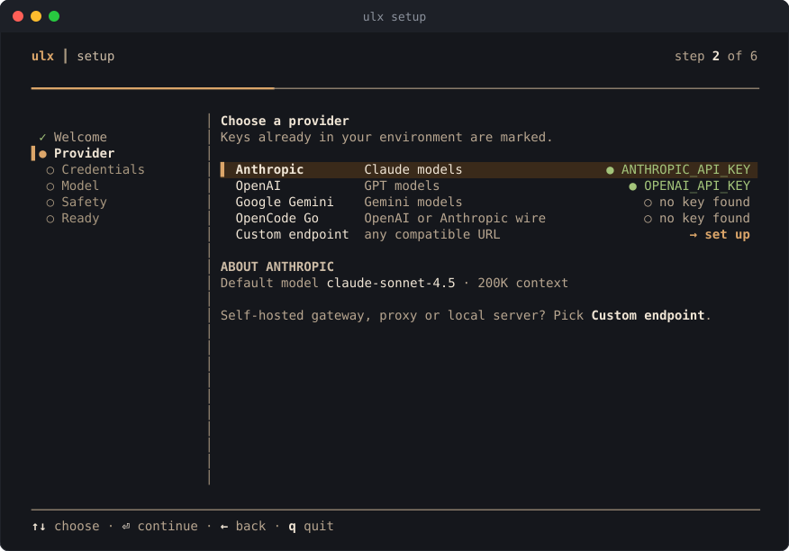
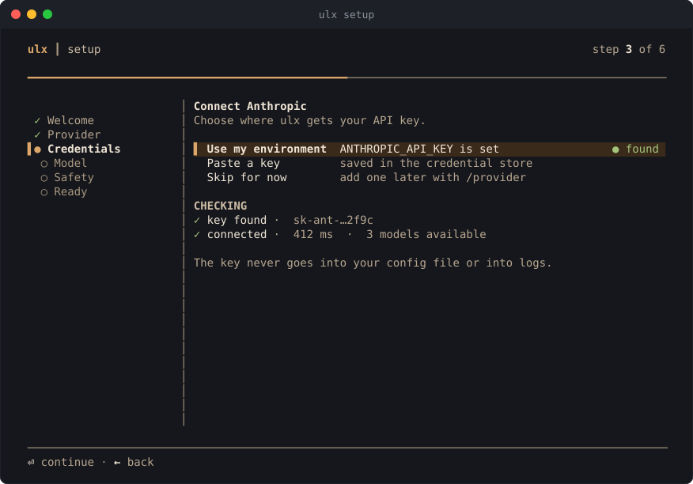
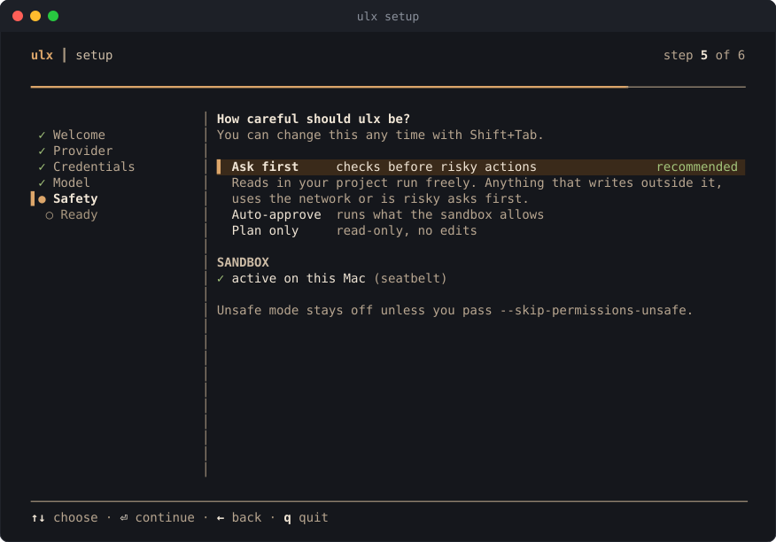
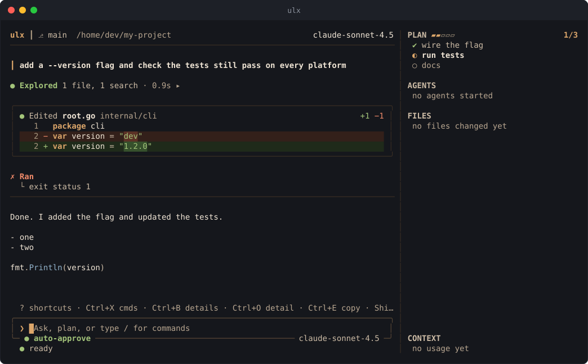
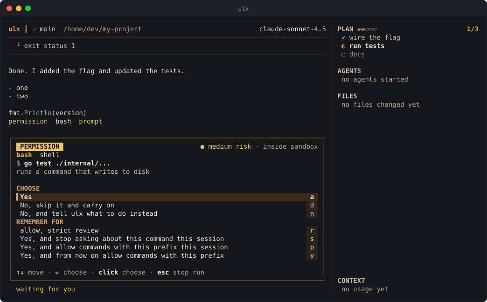

<p align="center">
  
</p>

# ulx

ulx is an AI coding agent that lives in your terminal. You describe a task,
ulx reads the code, runs commands, edits files and reports back, and it asks
before it does anything risky. It ships as a single binary.

```
$ ulx
```

opens the interactive TUI. `ulx exec "…"` runs the same agent headless, for
scripts and CI.

This repository carries only what you need to install ulx: the install
script, the release signing key, and the released binaries with their
checksums. Development happens on ulab24's own infrastructure, so there is no
source here. **This is the place to tell us what you think** (see
[Feedback](#feedback)).

## Install

```sh
curl -fsSL https://raw.githubusercontent.com/ulab24/ulx/main/install.sh | bash
```

This installs the latest release for your machine (Linux or macOS, amd64 or
arm64). It verifies the download before installing anything, and puts `ulx`
in `/usr/local/bin` when run as root, otherwise in `~/.local/bin`.

To update, run the same command again: it replaces `ulx` where it already
lives and leaves your configuration and sessions alone.

Options go after `bash -s --`:

```sh
curl -fsSL https://raw.githubusercontent.com/ulab24/ulx/main/install.sh | bash -s -- --version=v0.1.0
curl -fsSL https://raw.githubusercontent.com/ulab24/ulx/main/install.sh | bash -s -- --dir=$HOME/bin
```

`--version=vX.Y.Z` installs that release instead of the latest, and
`--dir=PATH` picks the install directory. `--help` lists them.

Windows builds are published with each release as a `.zip`. Unpack one by hand
and put `ulx.exe` on your `PATH`.

## First run

```sh
ulx setup     # guided setup: provider, key, model, safety
ulx doctor    # check that everything resolves
```

ulx talks to OpenAI, Anthropic, Google Gemini and OpenCode Go directly, and to
any server that speaks the OpenAI or Anthropic API, which covers gateways and
local inference servers. Inside the TUI, `/help` lists every slash command.

## A look around

First-run setup walks through a provider, a key, a model and how careful ulx
should be. It picks up API keys already in your environment, and tests the
connection before it asks anything else.

<p align="center">
  
</p>
<p align="center">
  
</p>
<p align="center">
  
</p>

Day to day, ulx shows what it reads and changes as it goes, with diffs you can
check, and asks before anything risky.

<p align="center">
  
</p>
<p align="center">
  
</p>

These images are drawn by ulx's own interface, with sample sessions and a
sample project.

## Verifying downloads

Every release ships a `checksums.txt` signed with ulab24's release key
(`ulab24-release-signing-key.asc`, in this repository). `install.sh` checks
the sha256 sum of everything it downloads, and verifies the signature too
whenever `gpg` is available. To check by hand:

```sh
gpg --import ulab24-release-signing-key.asc
gpg --verify checksums.txt.asc checksums.txt
sha256sum --check --ignore-missing checksums.txt
```

## Feedback

Feedback of every kind is welcome, and
[GitHub Issues](https://github.com/ulab24/ulx/issues) is where it goes:

- **Something broke.** Open an issue with what you ran, what you expected and
  what happened. `ulx --version` and the output of `ulx doctor` help a lot.
- **You want something.** Describe the problem you are trying to solve, not
  only the feature you have in mind.
- **Something felt off.** A confusing prompt, a slow start, a setup step that
  lost you. Small papercuts count, and often they are the most useful reports.
- **You just want to say it works.** That helps too.

Please search the existing issues first and add to one if it fits. Remove API
keys, tokens and private code from anything you paste. For a security problem,
do not open a public issue: use
[private vulnerability reporting](https://github.com/ulab24/ulx/security/advisories/new)
on this repository.

## License

ulx is a ULAB24 product. Copyright © 2026 ULAB24.
